```{r xaringan-extra, echo=FALSE}
library(xaringanExtra)
use_tile_view()
use_panelset()
use_tachyons()
```

```{r setup, include=FALSE}
options(htmltools.dir.version = FALSE)
knitr::opts_chunk$set(echo = TRUE, eval = FALSE)
library(here)
library(emo)
```


# An R Framework

Build a web application using premade tools

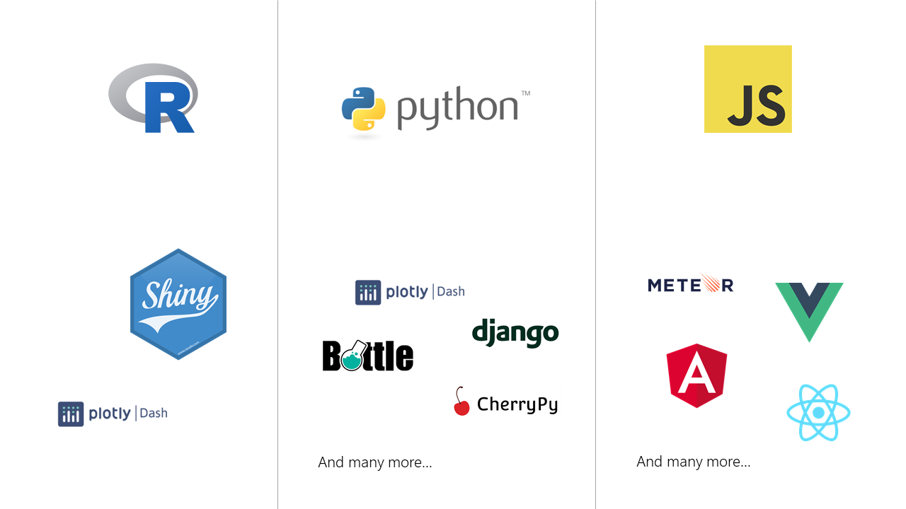

---

### Shiny in the Wild

.panelset[

.panel[.panel-name[App 1]
<iframe width="100%" height="400" src="https://jennadallen.shinyapps.io/pet-records-app/?_ga=2.129876812.1380069351.1614316913-2023337461.1608142979" frameborder="0" allow="accelerometer; autoplay; encrypted-media; gyroscope; picture-in-picture" allowfullscreen></iframe>

Source: [Jenna Allen, An App to Visualize and Share My Dogs' Medical History](https://jennadallen.shinyapps.io/pet-records-app/?_ga=2.129876812.1380069351.1614316913-2023337461.1608142979)
]

.panel[.panel-name[App 2]

<iframe width="100%" height="400" src="https://phillyo.shinyapps.io/intelligentsia/?_ga=2.126665933.1380069351.1614316913-2023337461.1608142979" frameborder="0" allow="accelerometer; autoplay; encrypted-media; gyroscope; picture-in-picture" allowfullscreen></iframe>

Source: [Philipp Reiner, Identifying real estate investment opportunities](https://phillyo.shinyapps.io/intelligentsia/?_ga=2.126665933.1380069351.1614316913-2023337461.1608142979)
]

]

---

class: inverse, center, middle

# Running an app

## A high level view

---

class: center, middle

### When our app is deployed, a shiny server is our web server

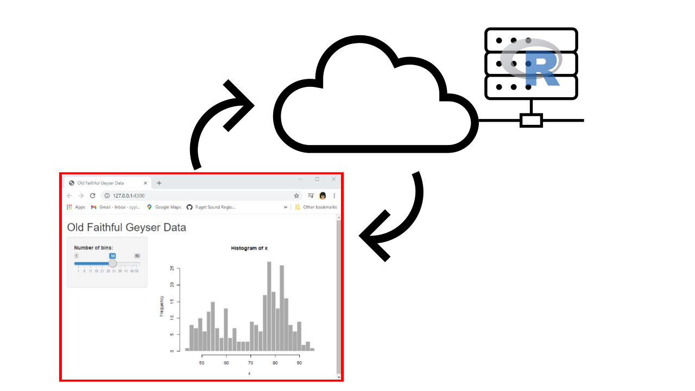

---

class: center, middle

### When running an app locally, our computer is the web server

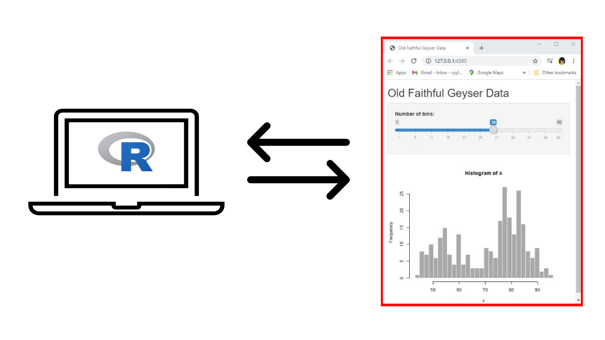


---

# Shiny Structure


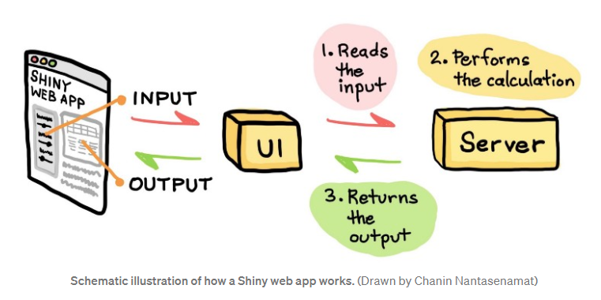

Image source: [Build Your First Shiny App in R, Chanin Nantasenamat towardsdatascience.com](https://towardsdatascience.com/build-your-first-shiny-web-app-in-r-72f9538f9868)


---

class: inverse, center, middle

# The UI

---

# Outputs

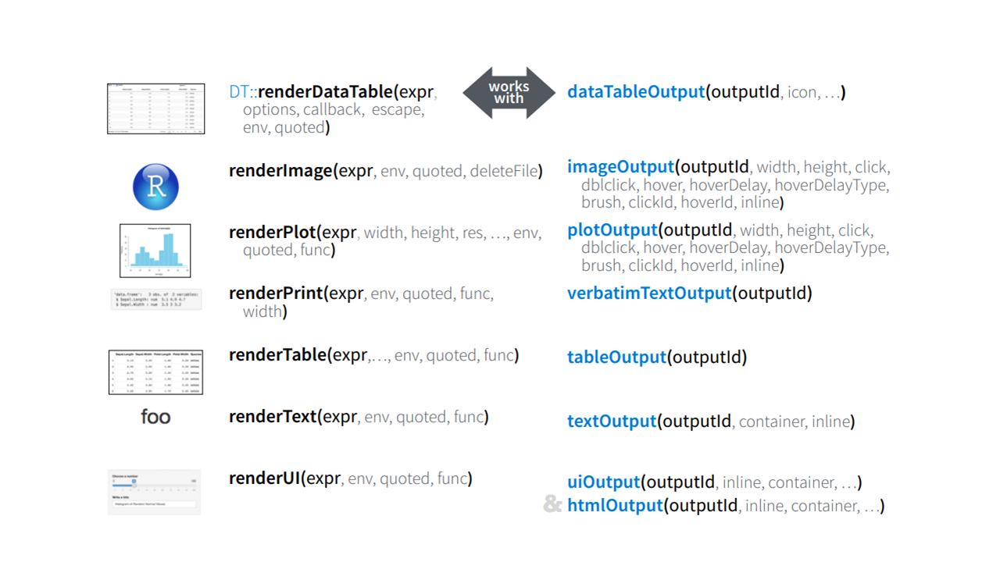
---

## App

```{r echo=FALSE, eval = TRUE, out.height='450', out.width='500', fig.align='center'}
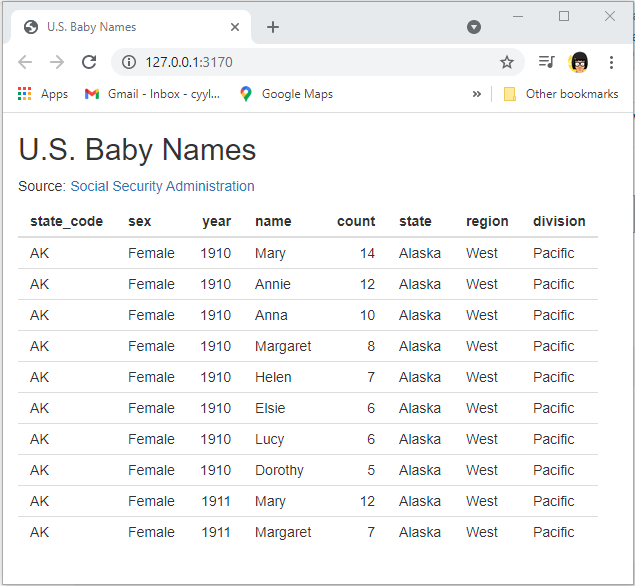
```


---

# Inputs

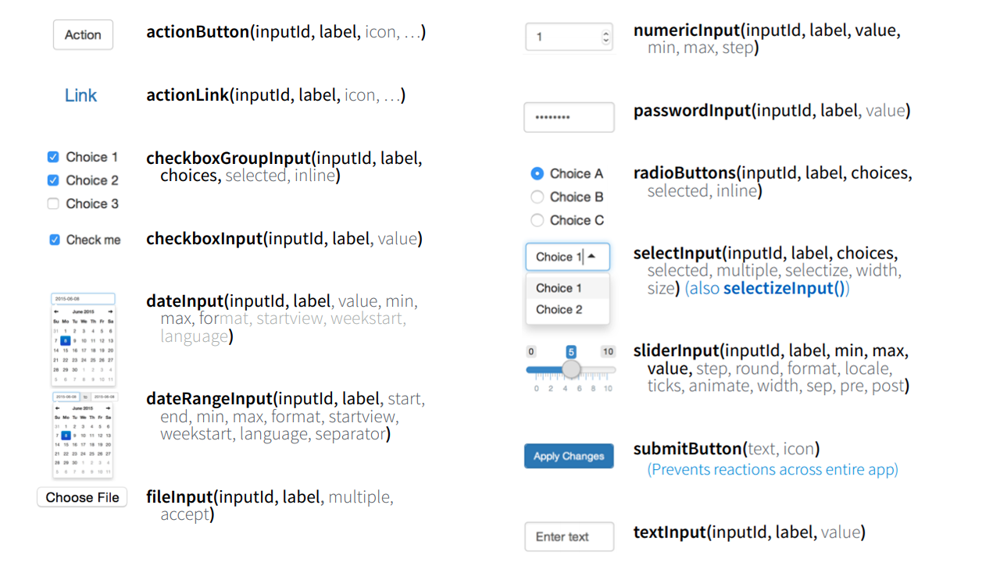

---

# Layout

```{r echo=FALSE, eval = TRUE, out.height='450', out.width='500', fig.align='center'}
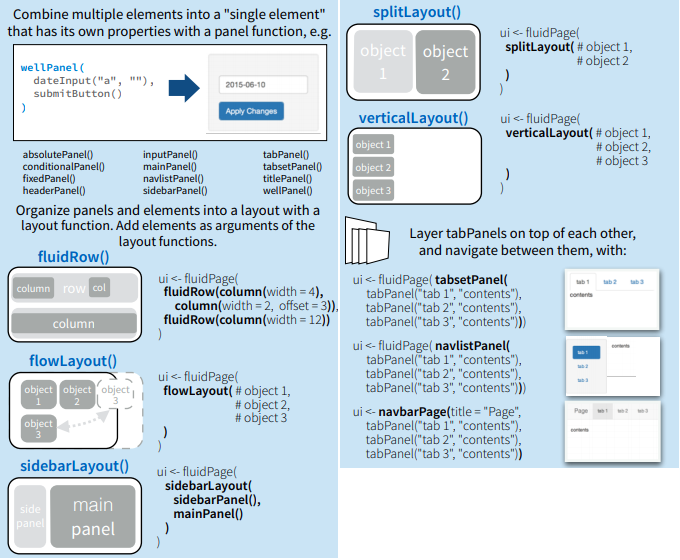
```

---

class: inverse, center, middle

# Reactivity

## The Building Blocks

---

## Reactive Programming

.middle[

.bg-washed-yellow.b--gold.ba.bw2.br3.shadow-5.ph4.mt5[...a style of programming that focuses on values that change over time, and calculations and actions that depend on those values...We want outputs to stay in sync with inputs, while ensuring that we never do more work than necessary.

.tr.right[--Hadley Wickham, *Mastering Shiny*]

]]

--

.bg-washed-green.b--green.ba.bw2.br3.shadow-5.ph4.mt5.flex.justify-around[

.div[
`reactive({})`

`observe({})`
]

.div[
`eventReactive({})`

`observeEvent({})`
]

]

---

## Reactive Programming

.middle[

.bg-washed-yellow.b--gold.ba.bw2.br3.shadow-5.ph4.mt5[...a style of programming that focuses on values that change over time, and calculations and actions that depend on those values...We want outputs to stay in sync with inputs, while ensuring that we never do more work than necessary.

.tr.right[--Hadley Wickham, *Mastering Shiny*]

]]

.bg-washed-green.b--green.ba.bw2.br3.shadow-5.ph4.mt5.flex.justify-around[

.div[
**`reactive({})`**

**`observe({})`**

]

.div[
`eventReactive({})`

`observeEvent({})`
]

]


---

### Reactives

```{r}
a_name <- reactive({
  # do stuff
})

```

- a conduit between reactive source and endpoint

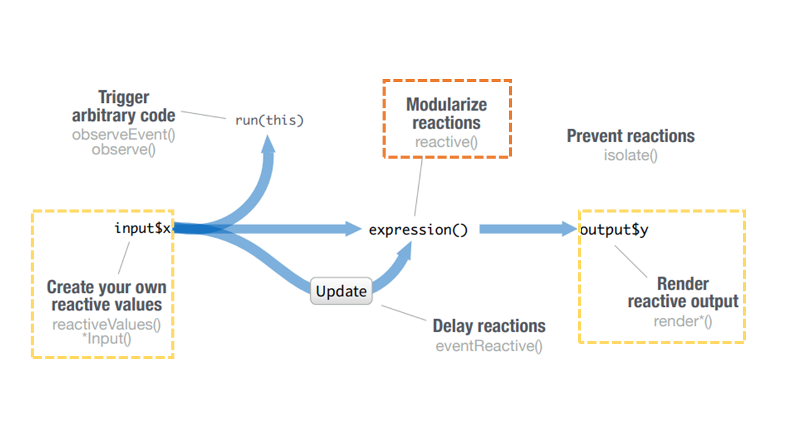

---

### Reactives

- can access other reactive values

```{r}
a_name <- reactive({
  # do stuff
})

another_name <- reactive({
  # do more stuff with a_name
  a_name() 
})
```

--

- returns a value (e.g. data frame, list, etc. )

--

- help avoid repetition

--

- decompose large complex code into smaller pieces

--

- returned value is cached until a reactive dependency is changed 

---

.pull-left[
## Reactives `r ji("zzz")`

```{r}
a_name <- reactive({
  # do stuff
})
```


- named

- very lazy

- called upon to do stuff

- returns a value


]

.pull-right[
## Observers `r ji("dashing_away")`

```{r}
observe({
  # do stuff right away
})
```

- not named

- very eager

- will react even when it doesn't have reactive dependents

- creates a side-effect


]
---

### Side-effects

Instead of storing the end-result in an R object, the end-result is some interaction with the 'external' world.

- `r ji('floppy_disk')` writing, saving, downloading a file to disk

- `r ji('scissors')` copying & `r ji('clipboard')` pasting files

- updating a database or web API

- `r ji('level_slider')` updating values of input widgets

---

class: inverse, center, middle

# Reactivity

## Delaying Reactions

---

### Delay with Events

.bg-washed-green.b--green.ba.bw2.br3.shadow-5.ph4.mt5.flex.justify-around[

.div[
`reactive({})`

`observe({})`
]

.div[
**`eventReactive({})`**

**`observeEvent({})`**
]

]


---

### Delay a reactive

.panelset[

.panel[.panel-name[Graph]
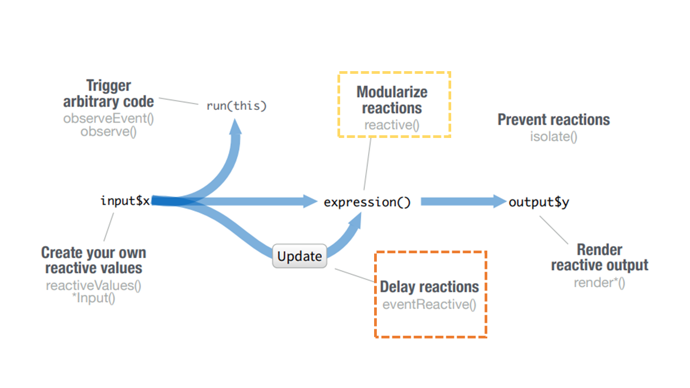
]

.panel[.panel-name[Events]
```{r}
a_name <- eventReactive(input$action_button, {
  # do stuff when button is clicked
})
```

```{r}
a_name <- eventReactive(input$checkbox %in% c(1, 2), {
  # do stuff when boxes 1 or 2 are checked
})
```
]

]

---

### Delay an observer

.panelset[

.panel[.panel-name[Graph]
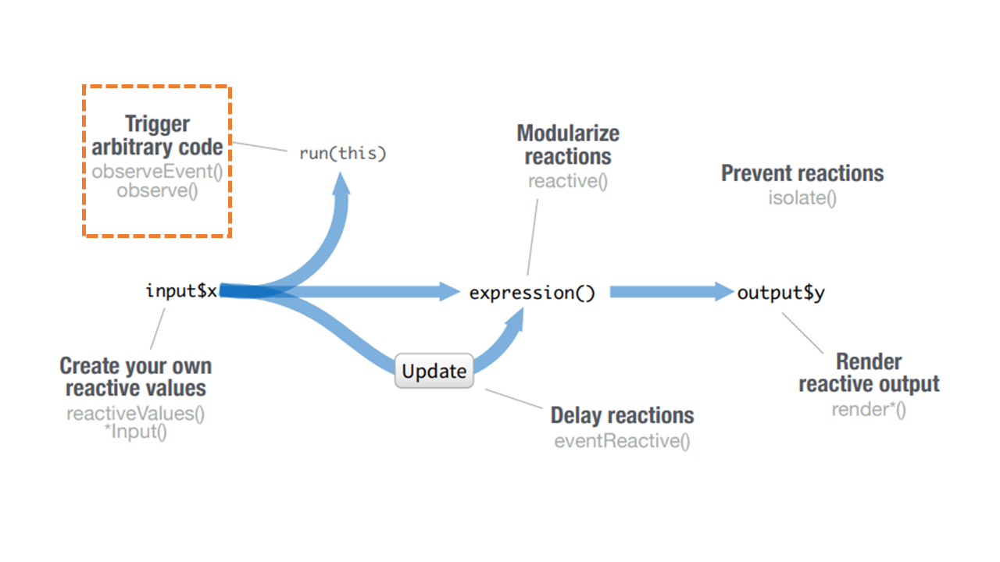
]

.panel[.panel-name[Events]
```{r}
observeEvent(input$action_button, {
  # do side-effect when button is clicked
})
```

```{r}
observeEvent(input$checkbox %in% c(1, 2), {
  # do side-effect when boxes 1 or 2 are checked
})
```
]

]

---

class: inverse, center, middle

# Styling

<iframe src="https://giphy.com/embed/yYSSBtDgbbRzq" width="480" height="360" frameBorder="0" class="giphy-embed" allowFullScreen></iframe><p><a href="https://giphy.com/gifs/frustrated-annoyed-programming-yYSSBtDgbbRzq">Cascading Style Sheets</a></p>

---

## Bootstrap

.pull-left[
- Default styling for Shiny

- A CSS framework for designing the UI

  - Reusable code combining HTML, CSS, and JS
  
  - Preset design (font-family, boldness, padding, etc.)
  
  - Creates responsive websites

]

.pull-right[
<iframe src="https://shiny.rstudio.com/gallery/widget-gallery.html" width="480" height="360" frameBorder="0" allowFullScreen></iframe>
]

---

class: center, middle

Using CSS to overwrite Bootstrap = working with tangled `r ji('yarn')`

<iframe src="https://giphy.com/embed/XbmdBop1Fn6J3dT6U6" width="200" height="200" frameBorder="0" class="giphy-embed" allowFullScreen></iframe><p><a href="https://giphy.com/gifs/cat-crazy-blue-XbmdBop1Fn6J3dT6U6"></a></p>


---

# shinyapps.io

## Create a login

You'll be asked to create an account name which is just the prefix of your future url. You can change this later in `Settings`

## Deleting an account
- the only way is by contacting support@rstudio.com
- [https://community.rstudio.com/t/delete-account-shinyapps-io/22692](https://community.rstudio.com/t/delete-account-shinyapps-io/22692)


