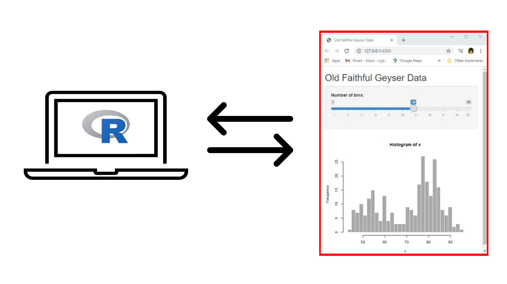
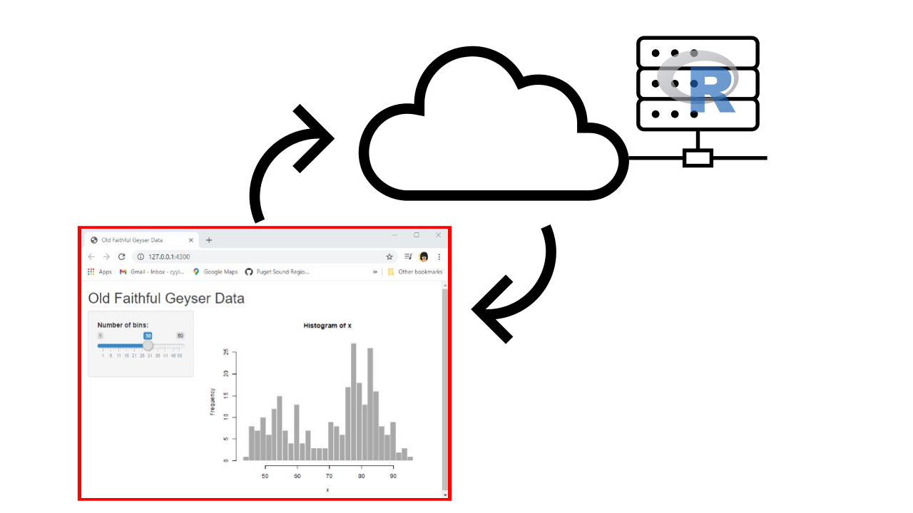
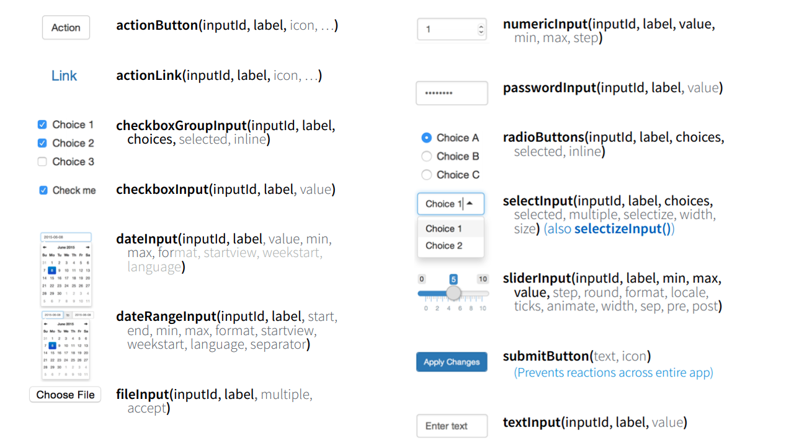
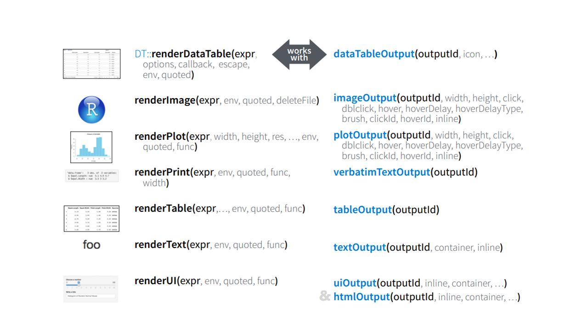

```{r setup, include=FALSE}
options(htmltools.dir.version = FALSE)
knitr::opts_chunk$set(echo = TRUE, eval = FALSE)
library(here)
```

class: inverse, center, middle

# Running an app

## A high level view

---

class: center, middle

### When running an app locally, our computer is the web server




---

class: center, middle

### When our app is deployed, a shiny server is our web server



---

# Inputs


---

# Outputs



---

class: inverse, center, middle

# Reactivity

---

# The Building Blocks

## Reactives

--

```{r}
a_name <- reactive({
  # do stuff
})
```

--

- very lazy

--

- called upon to do stuff

--

- named

--

- returns a value

---

.pull-left[
## Reactives `r emo::ji("zzz")`

```{r}
a_name <- reactive({
  # do stuff
})
```

- very lazy
- called upon to do stuff
- named
- returns a value

]

.pull-right[
## Observers `r emo::ji("dashing_away")`

```{r}
observe({
  # do stuff right away
})
```

- very eager
- will react even when it doesn't have dependents
- not named
- creates a side-effect

]
---

### Side-effects

Instead of storing the end-result in an R object, the end-result is some interaction with the 'external' world.


---

# shinyapps.io

## Create a login

You'll be asked to create an account name which is just the prefix of your future url. You can change this later in `Settings`

## Deleting an account
- the only way is by contacting support@rstudio.com
- [https://community.rstudio.com/t/delete-account-shinyapps-io/22692](https://community.rstudio.com/t/delete-account-shinyapps-io/22692)
---

# Hello World

Install the **xaringan** package from [Github](https://github.com/yihui/xaringan):

```{r eval=FALSE, tidy=FALSE}
devtools::install_github("yihui/xaringan")
```

--

You are recommended to use the [RStudio IDE](https://www.rstudio.com/products/rstudio/), but you do not have to.

- Create a new R Markdown document from the menu `File -> New File -> R Markdown -> From Template -> Ninja Presentation`;<sup>1</sup>

--

- Click the `Knit` button to compile it;

--

- or use the [RStudio Addin](https://rstudio.github.io/rstudioaddins/)<sup>2</sup> "Infinite Moon Reader" to live preview the slides (every time you update and save the Rmd document, the slides will be automatically reloaded in RStudio Viewer.

.footnote[
[1] 中文用户请看[这份教程](https://slides.yihui.org/xaringan/zh-CN.html)

[2] See [#2](https://github.com/yihui/xaringan/issues/2) if you do not see the template or addin in RStudio.
]

---
background-image: url(`r xaringan:::karl`)
background-position: 50% 50%
class: center, bottom, inverse

# You only live once!

---

# Hello Ninja

As a presentation ninja, you certainly should not be satisfied by the "Hello World" example. You need to understand more about two things:

1. The [remark.js](https://remarkjs.com) library;

1. The **xaringan** package;

Basically **xaringan** injected the chakra of R Markdown (minus Pandoc) into **remark.js**. The slides are rendered by remark.js in the web browser, and the Markdown source needed by remark.js is generated from R Markdown (**knitr**).

---

